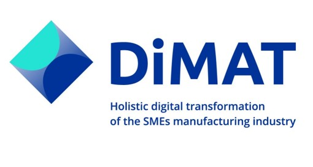

## Introduction to DiMAT

**DiMATApp** is a web-based task management platform that allows developers to manage tasks and users efficiently. It integrates seamlessly with existing tools and APIs to ensure smooth workflows.

### 1. Introduction

DimatApp promotes and enables task and user management through robust APIs and easy-to-use SDK features. It ensures the consistency and integrity of data while providing scalable tools for task tracking.

### 1.1. Tasks and Users

#### What is a Task?

A Task represents a unit of work within DummyApp. It includes properties like deadlines, assignees, and statuses.

#### What is a User?

Users are team members or collaborators who can be assigned to tasks.

#### How is it helpful?

This approach streamlines task management and collaboration, supporting productivity and scalability in team environments.
