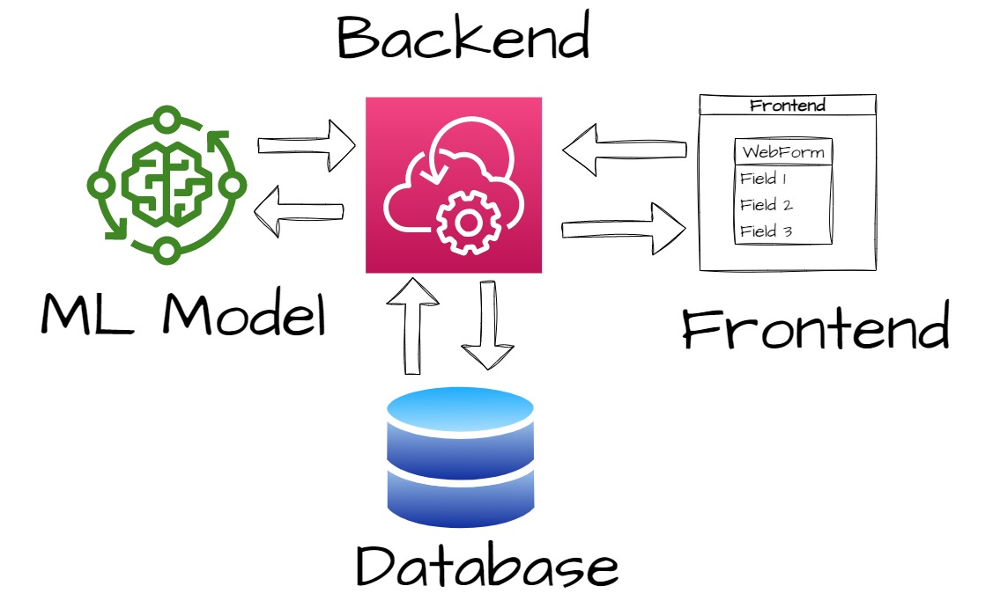

# DimatApp Application Flow

This document explains the flow of DimatApp, highlighting interactions between its components: **Frontend**, **Backend**, **ML Model**, and **Database**.
Below is the diagram describing the control flow in the DummyApp application.

---

## 1. Overview of Application Flow

1. Frontend: Users interact with DummyApp through a web-based form, sending requests (e.g., create tasks) to the backend.
2. Backend: Processes user input, validates it, communicates with the database, and interacts with the ML model for analytics or predictions.
3. ML Model: Provides insights like task completion predictions based on input data.
4. Database: Stores and retrieves data (tasks, users, configurations) as requested by the backend.

---

## 2. Components Explained

### Frontend
- Purpose: User interface for managing tasks and users.
- Example: A user submits a new task through a form, and the frontend sends the data to the backend.

### Backend
- Purpose: Connects the frontend with the database and ML model.
- Example: Validates task data, saves it to the database, and sends confirmation to the frontend.

### ML Model
- Purpose: Provides predictions or analytics.
- Example: Predicts task completion times based on historical data.

### Database
- Purpose: Stores tasks, users, and system configurations.
- Example: Saves a new task or retrieves user details.

---

## 3. Summary of Flow

- The **Frontend** collects user input.
- The **Backend** processes requests, interacts with the **Database**, and invokes the **ML Model** when needed.
- Responses are sent back to the **Frontend** for user display.

This modular design ensures efficient task management and seamless scalability.

---
